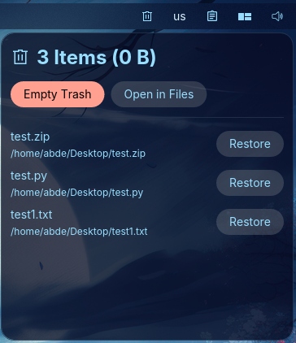
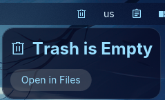

# 🗑️ COSMIC DE Trash Applet

A lightweight, native Trash applet for the **COSMIC Desktop Environment** (System76 / Pop!_OS 24.04) built in Rust using `libcosmic`.




---

## 💡 Why This Project Exists

The new **COSMIC Desktop Environment** on Pop!_OS 24.04 is fast, modern, and written entirely in Rust. However, out of the box, there was **no native panel or dock applet available for managing desktop Trash**.

Having to manually launch the file manager to inspect deleted files, restore an accidentally trashed document, or clear disk space was an unnecessary interruption. I created this dedicated applet to bridge that gap — giving Pop!_OS and COSMIC users a clean, instant, and interactive Trash manager right in their panel or dock.

---

## ✨ Features

- 🎨 **Dynamic Panel & Dock Icon**: Automatically toggles between empty (`user-trash-symbolic`) and full (`user-trash-full-symbolic`) icons based on trash contents.
- ⚡ **Real-Time Synchronisation**: Uses `notify` to watch `~/.local/share/Trash` for filesystem changes, ensuring instant icon and list updates without polling delay.
- ↺ **Individual File Restoration**: Parses Freedesktop `.trashinfo` metadata to restore files or directories back to their exact original location with a single click.
- 📂 **Native File Manager Integration**: "Open in Files" opens the `trash:///` location directly in **COSMIC Files**.
- ⚠️ **Safe Empty Trash**: Includes an interactive confirmation modal to prevent accidental data loss.
- 📊 **Detailed Summary**: Displays item count, individual original file paths, deletion dates, and formatted total disk space used.
- 🧩 **Native COSMIC Settings Integration**: Features `X-CosmicApplet=true` metadata so it appears natively in COSMIC Settings under Panel and Dock applets.

---

## 🛠️ Prerequisites & Build Dependencies

To build `cosmic-applet-trash` on Pop!_OS 24.04 or Ubuntu/Debian:

```bash
sudo apt update
sudo apt install -y cargo cmake just libexpat1-dev libfontconfig-dev libfreetype-dev libxkbcommon-dev pkgconf
```

---

## 🚀 Installation

### Quick Installation (Local User)

Clone the repository and run the local installation recipe:

```bash
git clone https://github.com/abde/cosmic-applet-trash.git
cd cosmic-applet-trash

# Build release binary and install to ~/.local
just user-install
```

This places:
- Binary $\rightarrow$ `~/.local/bin/cosmic-applet-trash`
- Desktop Entry $\rightarrow$ `~/.local/share/applications/com.github.abde.cosmic-applet-trash.desktop`

### Manual Compilation

```bash
cargo build --release
```
The compiled binary will be located at `target/release/cosmic-applet-trash`.

---

## ⚙️ Enabling the Applet in COSMIC

1. Open **COSMIC Settings** (press `Super` and search for *Settings*).
2. Navigate to **Desktop** $\rightarrow$ **Panel** (or **Dock**).
3. Click **Add Applet** (or **Applets** $\rightarrow$ **+ Add Applet**).
4. Select **Trash** from the list of available applets.
5. Drag and position the applet wherever you prefer on your panel or dock!

---

## 📄 License

Distributed under the **GPL-3.0 License**. See `LICENSE` for more information.
